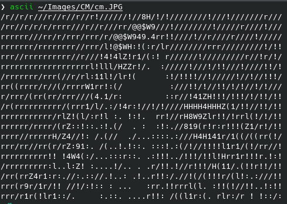
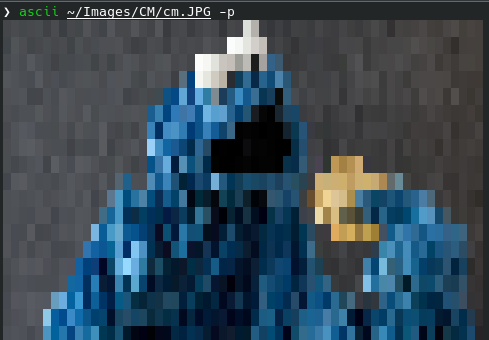
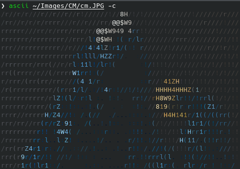
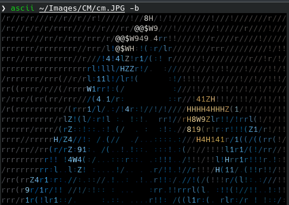
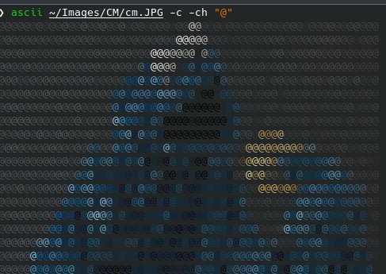
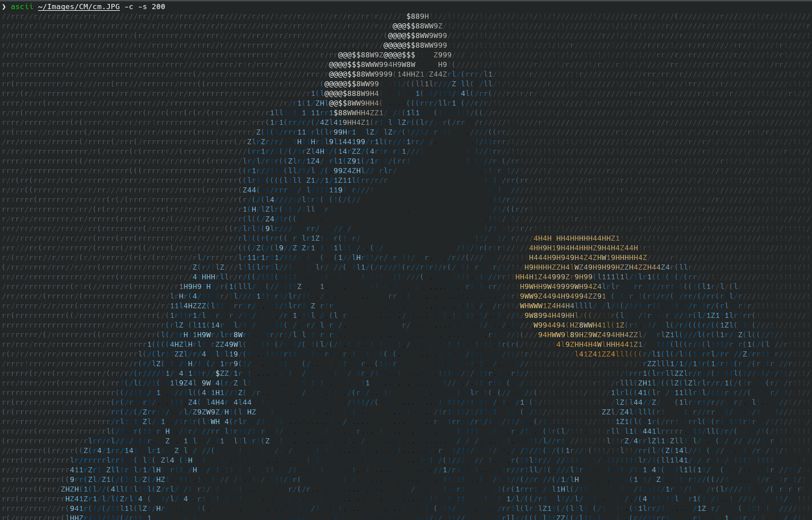

# ASCII
ASCII Graphic in the terminal.
Can display images, video from the file and from the webcam.

<details>
  <summary>Requirements</summary>

    OpenCV
    numba
</details>

<details>
  <summary>Usage</summary>

 ```
usage: main.py [-h] [-s SCALE] [-ch CHARS] [-c | -b | -p] path

positional arguments:
path                        Path to file, 0 for webcam video

options:
-h, --help                  Show this help message and exit
-s SCALE, --scale SCALE     Scale, default 70
-ch CHARS, --chars CHARS    Chars
-c, --colored               Colored, default false
-b, --bg                    Black background with colored image, default false
-p, --pixelart              Pixelart style, default false
 ```
</details>


## Examples
### Image

<details>
  <summary>Image default</summary>


</details>
<details>
  <summary>Image pixelart style</summary>


</details>
<details>
  <summary>Image colored</summary>


</details>
<details>
  <summary>Image colored with background</summary>


</details>
<details>
  <summary>Image colored with set chars</summary>


</details>
<details>
  <summary>Image colored with set scale</summary>


</details>

### Video
<details>
  <summary>Video default</summary>


</details>
<details>
  <summary>Video colored</summary>


</details>
<details>
  <summary>Video colored with background</summary>


</details>
<details>
  <summary>Video set chars</summary>


</details>
<details>
  <summary>Video set scale</summary>


</details>
<details>
  <summary>Video pixelart style</summary>


</details>

## Installing
```bash
sudo bash install.sh
```
It make symlink on `ascii` folder in this project in `/usr/local/lib/python3.10/dist-packages/` directory,
and starter script in `/usr/local/bin/` with name `ascii`.